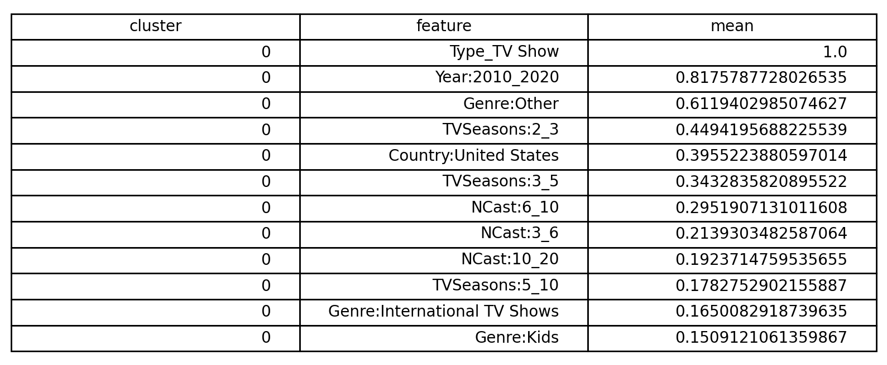
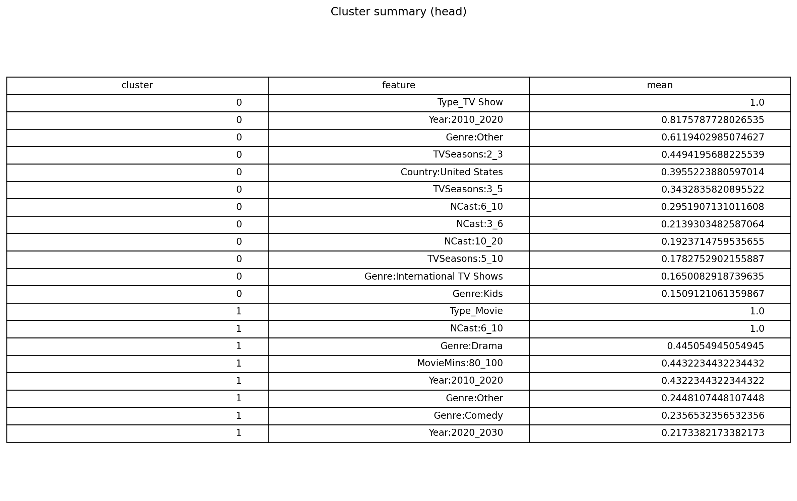
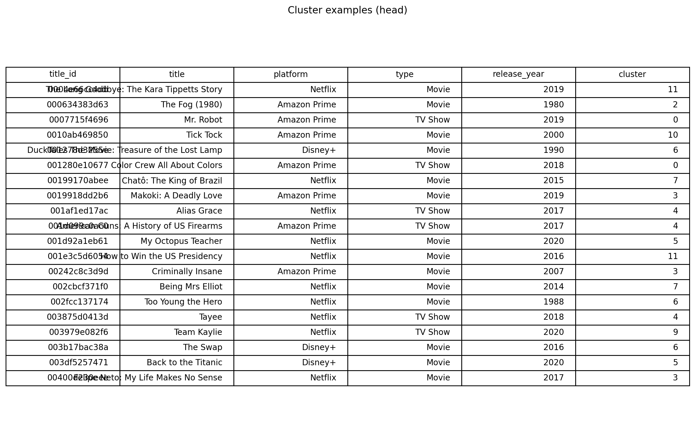

# 🎬 Streaming Content Similarity & Clustering

Build an interpretable, metadata-driven foundation for **content similarity analysis**
across streaming platforms.

This repository turns a cleaned streaming title catalogue into structured feature
matrices (genres, countries, type, year, duration, etc.) & applies unsupervised
clustering to uncover coarse **content archetypes**.

The project is intentionally designed as a **similarity-ready pipeline**:
the current focus is on data integrity, feature design, & clustering,
with explicit extension points for future similarity search & recommendation.

---

## What this does

1. **Builds a unified content catalogue** from raw platform exports  
2. **Engineers interpretable features** (multi-hot categorical + numeric signals)  
3. **Clusters titles using K-Means (Euclidean distance)**  
4. **Persists all artifacts** so results are reproducible & inspectable  

The result is a clean, debuggable pipeline suitable for:
- catalogue analysis
- exploratory structure discovery
- downstream similarity or recommendation work

---

## Project Structure

streaming_similarity/
├── data/
│ ├── raw/ # raw CSV inputs
│ └── processed/ # pipeline outputs
│ ├── catalog.parquet
│ ├── X_core.parquet
│ ├── X_core_meta.json
│ ├── X_cast.parquet
│ ├── X_cast_meta.json
│ ├── clusters_kmeans_k12.parquet
│ └── cluster_summary.csv
│
├── notebooks/
│ ├── 01_build_catalog.ipynb
│ ├── 02_exploration.ipynb
│ ├── 03_feature_engineering.ipynb
│ └── 04_clustering.ipynb
│
├── outputs/
│ ├── figures/
│ │ ├── cluster0_top_features.png
│ │ ├── cluster_summary_head.png
│ │ └── cluster_examples_head.png
│ └── tables/
│ └── cluster_examples.csv
│
├── src/
│ ├── data_loader.py
│ ├── feature_engineering.py
│ ├── clustering.py
│ ├── pipeline.py
│ └── similarity.py # placeholder for future similarity search
│
└── README.md

---

## Pipeline Overview

### 1️⃣ Build Catalogue
**`01_build_catalog.ipynb`**

- Loads raw platform exports
- Normalises schemas across providers
- Produces a unified catalogue keyed by `title_id`

Output: data/processed/catalog.parquet


---

### 2️⃣ Exploration
**`02_exploration.ipynb`**

- Missing-value analysis
- Distribution checks (year, duration)
- Genre and country frequency inspection
- Confirms multi-label categorical structure

This stage informs feature design rather than model training.

---

### 3️⃣ Feature Engineering
**`03_feature_engineering.ipynb`**

Produces a model-ready feature matrix: data/processed/X_core.parquet

Features include:
- Scaled numeric signals (e.g. release year)
- Multi-hot encoded genres
- Multi-hot encoded countries
- Platform indicators

Transformation metadata is persisted alongside features for traceability.

---

### 4️⃣ Clustering
**`04_clustering.ipynb`**

- Applies **K-Means (k = 12, Euclidean distance)**
- Uses a fixed `random_state` for determinism
- Profiles clusters via centroid feature weights
- Saves all results to disk

Generated artifacts:
clusters_kmeans_k12.parquet
cluster_summary.csv
cluster_examples.csv

---

## Example Outputs

### Cluster 0 — Top Features


### Cluster Summary (Head)


### Cluster Examples (Head)


These outputs support **qualitative inspection** and cluster validation.

---

## Engineering Notes

### Cluster Label Alignment Bug (Resolved)

An early pipeline version produced `NaN` cluster labels due to implicit
index alignment between persisted artifacts.

**Fix:**
- Enforced explicit joins on `title_id`
- Avoided reliance on DataFrame index state
- Validated joins before exporting downstream artifacts

This mirrors a common real-world ML pipeline failure mode.

---

## Interpretation Notes

- Clusters reflect **distributional similarity**, not user preference
- High-cardinality categorical features dominate signal
- Platform indicators strongly influence grouping
- K-Means is a baseline, chosen for interpretability

---

## 🔎 Similarity Search (Baseline)

This project includes a **minimal, interpretable similarity lookup** using
**cosine similarity over the engineered `X_core` feature matrix**.

Similarity is implemented in `src/similarity.py` and is intended as a
**baseline for validating the feature space**, not a full recommendation system.

### Example (from repo root)

```bash
python -m src.similarity <TITLE_ID> 10

---

## Quickstart

```bash
python -m venv .venv
source .venv/bin/activate
pip install -r requirements.txt

python -m src.pipeline


## 🔎 Similarity Search (Baseline)

This repo includes a minimal content-based similarity lookup using **cosine similarity over `X_core`**.

### Run from repo root

```bash
python -m src.similarity <TITLE_ID> 10


---

# Note: 
# `requirements.txt` lists only direct project dependencies.
# Notebook UI dependencies are intentionally omitted.

# NOTE:
# This is an exact (brute-force) cosine KNN.
# For large catalogs, this can be swapped for ANN (FAISS / Annoy) without
# changing the public API.